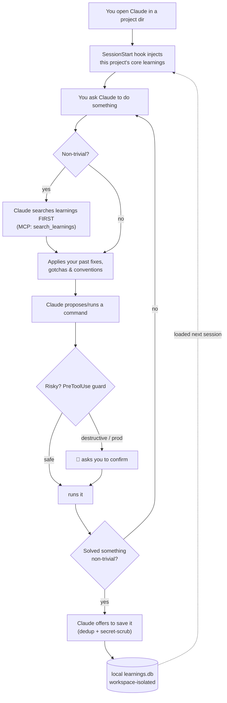

# Learnings — personal institutional memory for Claude

A local, per-project knowledge base of your own "learnings" (past solutions, patterns,
lessons) with **semantic search**, exposed to Claude Code / Claude Desktop as an MCP
server. Before doing anything non-trivial, Claude searches it first; after solving
something non-trivial, Claude offers to save it. Over time you stop re-solving the same
problems — and each project stays isolated.

Inspired by a team version on AWS Lambda + RDS pgvector + Bedrock + Auth0. This is the
zero-cloud, single-user adaptation:

```
Claude  <-- stdio/MCP -->  learnings-mcp (Python)
                             ├── SQLite + sqlite-vec   (records + vector KNN)
                             └── fastembed             (on-device embeddings, no API key)
```

- **No cloud, no cost, no keys.** Everything runs on your machine.
- **One file of data** at `~/.learnings/learnings.db` (override with `LEARNINGS_DB_PATH`).
- **Secret redaction** strips API keys, tokens, private keys, and emails before storage.

## How it works (and how it helps Claude)

Every Claude Code session becomes a loop that gets smarter over time. You do nothing
special — just work in a project directory and talk to Claude normally.



**Why this makes Claude more useful:**
- **Starts with your context** — core facts (architecture, who-decides-what, your writing
  style) are injected at session start, so Claude doesn't ramp up from zero every time.
- **Stops re-solving** — it checks past learnings *before* acting, so a problem you cracked
  once isn't rediscovered from scratch (or repeated as a mistake).
- **Protects you** — the traffic-light rule + guard hook won't fire destructive/prod
  commands without a confirm.
- **Compounds** — every non-trivial fix can be saved, so the base gets better as you work,
  and each project stays isolated from the others.

## Quickstart (per-machine, isolated)

The common setup when you work across several projects: **each PC is its own self-contained install** with a
local `~/.learnings/learnings.db`. Nothing is shared between machines, so you physically
never see another project's learnings. Git holds only *this code*.

```bash
sudo apt install -y python3 python3-venv git          # WSL/Linux prerequisites
git clone <your-learnings-code-repo> ~/learnings && cd ~/learnings
./bootstrap.sh "" project-a                            # empty DB, pin this machine to workspace 'project-a'
```
That installs deps, registers the MCP server (user scope), and wires the hooks + rules.
Start a fresh Claude session and go. **Workspaces are created on demand** — just naming
one (via the pin above, a `~/project-a/...` directory, or `--workspace project-a`) is all
it takes; there's no "create workspace" step. Reusing a machine for a new project later?
Re-run with a new name or add it: `LEARNINGS_WORKSPACES=project-a,newproject`.

Back up anytime: the UI **⇩ Backup** button or `learnings backup` writes a timestamped
copy to `~/.learnings/backups/`. (Cross-machine git sync is available but optional — see
below — and not needed for the isolated setup.)

## Concepts

- **Workspace** — a project boundary (`project-a`, `project-b`, `project-c`, …).
  Auto-detected from the working directory in Claude Code, or pinned via
  `LEARNINGS_WORKSPACE` in Claude Desktop. **Search never crosses workspaces** — a
  confidentiality boundary, not just tidiness.
- **`base` workspace** — cross-cutting knowledge (kubectl/terraform/CI gotchas) mixed
  into *every* workspace's search.
- **Core learnings** — a small, capped (`LEARNINGS_CORE_CAP`, default 12) set of
  always-relevant facts per workspace, injected into context at session start.
- **Near-duplicate guard** — `create_learning` refuses to store a learning that's very
  similar to an existing one in the same workspace, pointing you to `enrich` instead.
- **Provenance (`references`)** — each learning records where it came from: an entry on
  create and one per enrichment (session id, transcript path, timestamp, optional note,
  captured automatically by the SessionStart hook). Provenance is **never** embedded,
  FTS-indexed, or used in dedup — it's traceability only, so it can't skew search. It
  travels with git sync and shows in the UI (📎).

## Search

Search is **hybrid**: a vector KNN (semantic, via fastembed) and an SQLite **FTS5**
keyword index are each ranked, then fused with Reciprocal Rank Fusion. Semantic recall
finds paraphrases; the keyword side nails exact identifiers (`svc-db-01`,
`enable_legacy_mode`, error codes) that embeddings blur. The FTS index is kept in
sync by triggers and degrades to vector-only if FTS5 isn't in your SQLite build.

## Tools exposed to Claude

| Tool | What it does |
|------|--------------|
| `search_learnings(query, project?, workspace?, limit?)` | Semantic search within the current workspace + base |
| `create_learning(title, content, tags?, project?, workspace?, is_core?, force?)` | Save a learning (refuses near-dupes unless `force`) |
| `enrich_learning(id, context)` | Append context to an existing learning |
| `list_learnings(tags?, project?, workspace?, limit?)` | Browse the current workspace + base |
| `get_core_learnings(workspace?)` | The always-on facts for the current workspace |

## Install

```bash
cd learnings
python3 -m venv .venv && . .venv/bin/activate
pip install -e .
```

First search/create downloads the embedding model (~130MB) once; cached afterward.

## Wire it into Claude Code (all projects)

```bash
claude mcp add learnings -s user \
  -e LEARNINGS_DB_PATH=$HOME/.learnings/learnings.db \
  -- $HOME/claude-project/learnings/.venv/bin/python -m learnings_mcp.server
```

Then, for automatic behavior:
- Append [`rules/CLAUDE.md`](rules/CLAUDE.md) to `~/.claude/CLAUDE.md` (search-before /
  suggest-after, workspace-aware).
- Add the SessionStart hook to `~/.claude/settings.json` so core learnings load each
  session (auto-detects workspace from the directory):

```json
{
  "hooks": {
    "SessionStart": [
      { "hooks": [ { "type": "command",
        "command": "/home/you/claude-project/learnings/.venv/bin/python -m learnings_mcp.cli hook" } ] }
    ]
  }
}
```

## Wire it into Claude Desktop

See [`rules/claude-desktop.md`](rules/claude-desktop.md) — pin the workspace via env,
paste the rules into custom instructions, and mind the cross-machine DB note.

## Use it directly (CLI)

```bash
learnings add -t "Title" -c "..." --tags ci,deploy --project my-repo --workspace project-a
learnings add -t "Always plan before apply" -c "..." --workspace base --core   # always-on
learnings search "vector search returns nothing" --workspace project-a
learnings list --workspace project-a
learnings enrich <id> -c "extra context to append"
learnings core --workspace project-a          # show always-on set
learnings core-set <id>  / core-unset <id>   # toggle a learning's core flag
learnings review --workspace project-a        # curation: stale + never-used candidates
learnings verify <id>                        # mark re-verified now (resets staleness)
learnings rm <id>
```

### Curation (keeps the base from rotting)

Every search bumps a learning's `hit_count` / `last_used`, and each learning carries a
`verified_at`. `learnings review` (and the UI) surface two candidate lists:
- **stale** — `verified_at` older than `LEARNINGS_STALE_DAYS` (default 180); re-check the
  fact and `verify` it, or delete it.
- **cold** — never surfaced by search and not new; likely prune candidates.

Keep **core** tiny — it auto-injects every session, so reserve it for a handful of
always-relevant items (a bloated core taxes every interaction).

## Browse with the local UI

```bash
learnings ui                              # local only: http://127.0.0.1:8765
learnings ui --host 0.0.0.0               # reach it from your LAN (token auto-required)
learnings ui --host 0.0.0.0 --token mysecret --no-browser
```

A tiny stdlib web server (no Docker, no extra deps) to browse and manage learnings:
filter/semantic search, switch workspace, see the core set, toggle core (★), append
context, delete, and add. It reads the same `~/.learnings/learnings.db`, so anything you
change shows up in Claude immediately.

**Running on a remote box you SSH into?** Two options:
- **SSH tunnel (most secure, nothing exposed):** keep the default bind and forward the
  port from your laptop — `ssh -L 8765:localhost:8765 you@box`, then open
  `http://localhost:8765` locally.
- **LAN bind:** `learnings ui --host 0.0.0.0`. Any non-loopback bind **auto-requires a
  token** (printed in the URL as `?token=…`) since the DB holds real infra knowledge;
  the page forwards it as an `X-Token` header. Pass your own with `--token`.

> Why not Docker? This is a single local SQLite file on your machine — the DB, MCP
> server, and UI all run natively. A container would add moving parts for no benefit.
> Docker only makes sense if you later promote this to a shared multi-user service.

## Security & privacy

The DB holds real infra knowledge, so the design keeps it local and minimises exposure:

- **Owner-only files** — the DB is created `0600` and `~/.learnings/` `0700` automatically.
- **Secret redaction on write** — API keys, tokens, private keys and emails are scrubbed
  before anything is embedded or stored (`redact.py`).
- **Per-machine isolation** — no cross-project data on a machine unless you put it there;
  that's the confidentiality boundary between projects/clients.
- **No secrets in the repo** — project-specific names/patterns live in machine-local files
  (`~/.learnings/workspaces.txt`, `guard.json`), never in the code.
- **LAN UI is token-gated** — any non-loopback bind auto-requires a token.

**Encrypting the data — recommended approach:**
- **Full-disk encryption is the right primary control** — LUKS (Linux), BitLocker
  (Windows/WSL), FileVault (macOS). It protects the DB, backups, and everything else with
  zero app complexity. If a machine holds client data, it should have this anyway.
- **Encrypt anything that leaves the machine** — gpg/age a backup before copying it off, or
  `git-crypt`/`age` a sync repo. That's where the real exposure is (a copy on untrusted
  storage), not the local file on an encrypted disk.
- **SQLite-level encryption (SQLCipher)** is possible but not built in: Python's stdlib
  `sqlite3` doesn't support it, it needs `pysqlcipher3` + sqlite-vec compatibility work, and
  it adds a key-management problem. For a single-user local tool on an encrypted disk the
  marginal value is low — reach for it only if you have a specific threat model (e.g. the DB
  file itself must be encrypted at rest independent of the disk).

## Configuration

| Env var | Default | Purpose |
|---------|---------|---------|
| `LEARNINGS_DB_PATH` | `~/.learnings/learnings.db` | SQLite database location |
| `LEARNINGS_WORKSPACE` | (auto from cwd) | Pin the workspace (Claude Desktop) |
| `LEARNINGS_WORKSPACES` | `project-a,project-b,project-c` | Known project roots under `$HOME` |
| `LEARNINGS_CORE_CAP` | `12` | Max always-on core learnings per workspace |
| `LEARNINGS_DUP_DISTANCE` | `0.5` | Near-duplicate threshold (lower = stricter) |
| `LEARNINGS_EMBED_MODEL` | `BAAI/bge-small-en-v1.5` | fastembed model (384-dim) |
| `LEARNINGS_EMBED_DIM` | `384` | Must match the model's output dimension |

## Swapping the embedder later

Everything routes through `embed(text) -> list[float]` in `learnings_mcp/embeddings.py`.
To use a hosted provider (Voyage / OpenAI / Bedrock), implement that one function and
set `LEARNINGS_EMBED_DIM`. Existing rows need re-embedding.

## Onboarding a new project (importer)

```bash
learnings scan ~/project-c                 # 1. find candidate knowledge sources
#                                            2. Claude reads them → writes drafts.json
learnings ingest drafts.json               # 3. DRY RUN: shows NEW vs near-DUPLICATE
learnings ingest drafts.json --apply       # 4. writes only the NEW ones
```

`drafts.json` is a list of `{title, content, tags, workspace, project, is_core}`.
Ingest is **dry-run by default** and dedups every entry against the existing corpus, so
a bad batch can't silently pollute the knowledge base.

## Eval harness

```bash
learnings eval               # uses evals/retrieval.json
learnings eval mycases.json
```

Runs real questions against the corpus and reports **hit@1 / hit@3 / MRR**. Run it after
changing search (RRF, dup threshold) or swapping the embedder. It earns its keep: it
caught that FTS5's default tokenizer doesn't stem, and switching to `porter` took the
suite from hit@1 67% → 83% and hit@3 92% → 100%.

## New machine (WSL / laptop / another server)

WSL is just Linux, so it's the same install. One command bootstraps everything —
venv + deps, MCP registration at user scope, the SessionStart + guard hooks, and the
CLAUDE.md rules (idempotent, merges into any existing `~/.claude`):

```bash
# 0. prerequisites (WSL):  sudo apt install -y python3 python3-venv git
# 1. get the PRODUCT code onto the machine (clone your fork, or copy this folder)
git clone <your-learnings-product-repo> ~/learnings && cd ~/learnings

# 2a. UNIFIED — share one brain across machines (import your private knowledge repo):
git clone <your-private-knowledge-repo> ~/.learnings/repo
./bootstrap.sh ~/.learnings/repo

# 2b. SEPARATE — this machine only holds one project + base:
#     clone a knowledge repo that contains only base/ (+ that project), or start empty:
./bootstrap.sh                     # empty DB, auto-detect workspace from cwd
./bootstrap.sh ~/.learnings/repo newproject   # ...or import + PIN every session to 'newproject'
```

Then start a fresh Claude session. Two machine-specific notes:
- **Absolute paths differ per machine** — don't copy the server's `settings.json`/MCP
  config verbatim; `bootstrap.sh` writes the correct local paths for you.
- **New project = new workspace.** Either name a directory root it auto-detects
  (`~/newproject/...`), extend `LEARNINGS_WORKSPACES=...,newproject`, or pin the machine
  with the `PINNED_WORKSPACE` arg above (best for a single-project laptop).

Keep machines in step by running `learnings sync` on each (see below).

## Sync across machines (git)

The DB is the local source of truth; a git repo of Markdown files is the versioned
interchange format (one file per learning at `<repo>/<workspace>/<id>.md`). Embeddings
and usage stats aren't synced (re-derived / machine-local); the knowledge + curation
flags (`is_core`, `verified_at`) are.

```bash
learnings export [dir]          # DB → markdown files (default ~/.learnings/repo)
learnings import [dir]          # markdown files → DB (upsert; re-embeds changed text)
learnings sync   [dir] -m msg   # export → commit → pull --rebase → import → push
```

First-time setup on machine A:
```bash
learnings export ~/.learnings/repo
cd ~/.learnings/repo && git init && git add -A && git commit -m init
git remote add origin <your-private-git-url> && git push -u origin main
```
On machine B (e.g. the box you use for Odyssey): clone it, `pip install -e .`, then
`LEARNINGS_SYNC_DIR=~/.learnings/repo learnings import`. After that, `learnings sync`
on either machine keeps both in step (git handles merges; conflicts are surfaced with
instructions). Override the location per-run with a `dir` arg or `LEARNINGS_SYNC_DIR`.

> Keep the repo **private** — it holds your infra knowledge.

For multi-*user* (a shared team brain), promote to a Postgres + HTTP service (the
original team design) — the schema and tool contract already map onto it.
